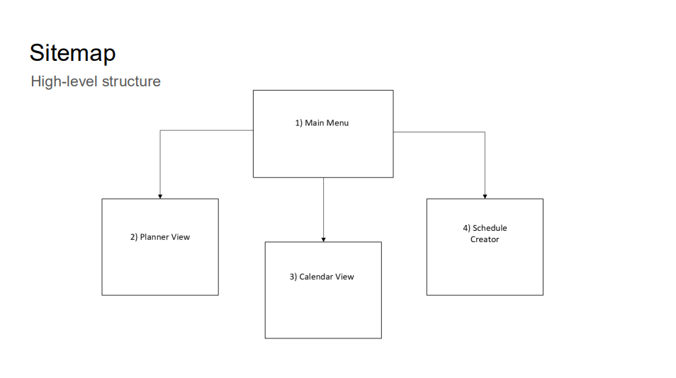
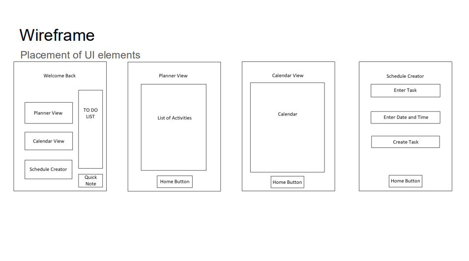

# CS-361-Student-Planner (BETA)
Planner application that will help students balance both academic and personal commitments for CS 361
Will serve as a course project in CS 361

# Student Planner
**CS 361 - Software Engineering I**  
*A comprehensive task management and scheduling application for students*

##  Project Overview

The Student Planner is a user-friendly application designed to help students organize their academic and personal tasks efficiently. The app provides multiple viewing formats and intuitive task creation to accommodate different organizational preferences and learning styles.

##  Features

### Core Functionality
- **Multiple View Options**: Calendar view, planner view, and to-do list format
- **Task Creation**: Simple, streamlined schedule creator with minimal required fields
- **Quick Notes**: Instant note-taking functionality accessible from the main menu
- **Task Management**: Check off completed tasks and edit existing entries

### User Experience Focus
- **Consistent Navigation**: Familiar back buttons and home screen access across all views
- **Flexible Organization**: Choose between different task visualization methods
- **Intuitive Interface**: Clean, straightforward design with minimal learning curve

##  Design Process

### User Interface Design
This project emphasizes thoughtful UI/UX design following inclusivity heuristics to ensure accessibility and usability for all students. The target audience to this planner are students trying to organize their personal and academic schedules

#### Sitemap

*High-level application structure showing navigation flow between microservices*

#### Wireframes

*Detailed wireframes showing UI element placement*

### Inclusivity Heuristics Implementation

**IH#1 - Explain Benefits**: Homepage provides clear overview of functionality with visible to-do list and quick note features

**IH#2 - Explain Costs**: Streamlined task creation requires only essential information (name, date, time)

**IH#3 - Information Control**: Multiple viewing formats (calendar, planner, to-do list) let users choose their preferred organization method

**IH#4 - Familiar Features**: Consistent navigation patterns and button placement across all screens

**IH#5 - Undo/Redo Available**: Task completion checking and edit functionality for easy modification

**IH#6 - Explicit Task Path**: Clear sequence from viewing tasks → creating tasks → form completion

**IH#7 - Try Different Approaches**: Calendar view vs. planner view options for different user preferences

**IH#8 - Mindful Tinkering**: Flexible usage allowing users to focus on specific features (to-do only) or explore full functionality

##  Current Status

**Phase**: Design and Planning, implementation in progress. 

## 📋 Paper Prototypes

### 1. Main Menu
Central hub featuring navigation options, to-do list preview, and quick note functionality

### 2. Planner View  
List-based activity overview with chronological organization

### 3. Calendar View
Traditional calendar interface for date-based task visualization

### 4. Schedule Creator
Streamlined task creation form with essential fields only

##  Course Integration

This project is being developed as part of CS 361 (Software Engineering I) with emphasis on:
- User-centered design principles
- Inclusivity and accessibility considerations
- Software engineering best practices
- Iterative development methodology

## Design Tools

- **Wireframing & Sitemap**: Microsoft Visio
- **Design Documentation**: Inclusivity Heuristics Framework

## Future Enhancements

- Integration with existing calendar applications
- Progress tracking and analytics

